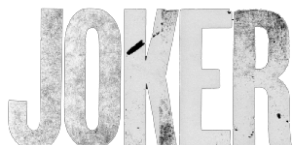
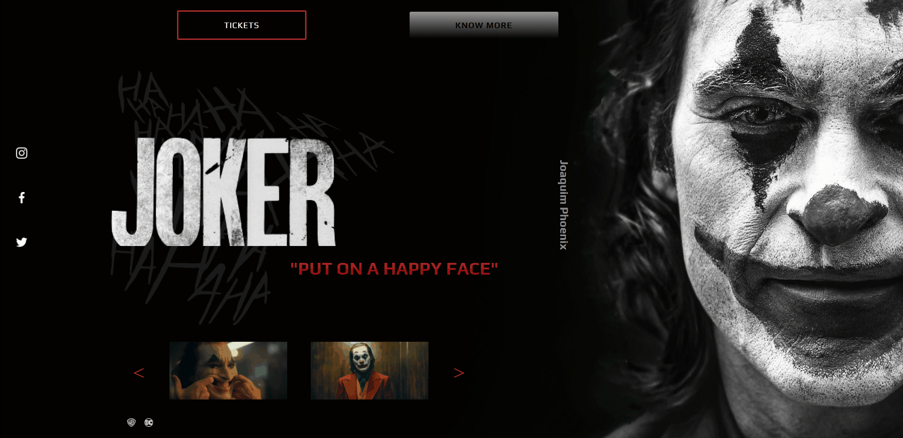

<h1 align="center">
    
     
     
    Interface de compra dos ingressos do filme The Joker.
</h1>

    
        

<h4 align="center">
    Projeto feito com a intenção de aprimoramento das skills com as tecnologias utilizadas.
</h4>
 

    

#### 🚀 Tecnologias
 

### 📝 Licença
O projeto contém a licença MIT. Para mais informações acesse [LICENSE](https://github.com/tamirysnogueira/Deezer/blob/master/LICENSE).

 

Feito com 💖 por TamirysNogueira. [Get in Touch!](https://www.linkedin.com/in/tamirys-nogueira-346958205/)